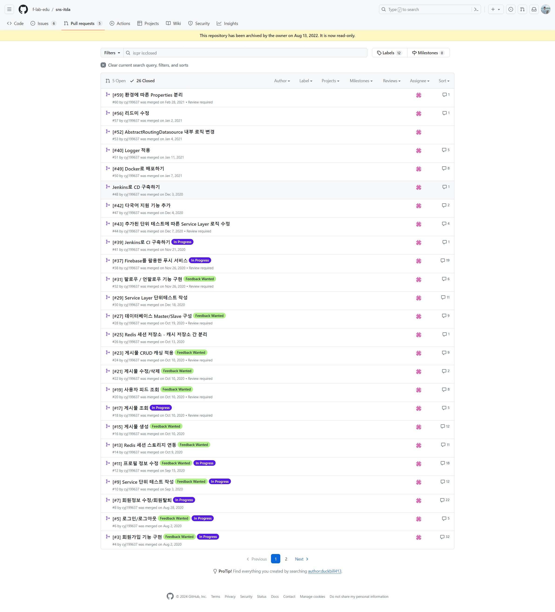

# Git Convention

참조) https://velog.io/@duckbill/Git-Flow

Git을 사용하여 개발하는 개발 환경에서 Branch 간의 문제 없이 배포까지 안정적으로 할 수 있도록 Branch를 관리하는 전략  
release가 자주 발생하는 프로젝트에 최적화

## 브랜치 전략

1. `Main(= Master)`

   실제 운영 환경에 나가 있는 코드만 갖고 있는 브랜치

2. `Develop`

   메인 브랜치를 베이스로 생성한 브랜치. 다음 배포에 나갈 feature 을 머지하는 공간

3. `Feature`

   개발을 할 때 브랜치를 새로 만들고 해당 브랜치에 커밋을 진행한 뒤 작업이 종료되면 Develop 브랜치에 커밋하게 된다.
    - `feature/1-login-member` 멤버의 로그인 구현 브랜치

4. `Release`

   정말로 배포를 하는 단계에서 Develop 브랜치를 베이스로 Release 브랜치를 생성.

   Release 브랜치 생성후 부터는 Develop 브랜치에 작업을 하지 않고 Release 브랜치에 직접 작업을 진행.

   Release 브랜치 배포 이후 QA 및 개발 테스트가 완료된다면 Release 브랜치를 Main 브랜치에 머지

5. `Hotfix`

   의도치 않은 장애가 발생하였을때 메인 브랜치에서 브랜치를 생성한 이후 당장 수정이 필요한 최소한의 부분만 수정을 하여 메인 브랜치에 머지를 진행

## Commit Message 전략
- `feat` : 새로운 기능 추가
- `fix` : 버그 수정
- `docs` : 문서 수정
- `style` : 코드 formatting, 세미콜론(;) 누락, 코드 변경이 없는 경우
- `refactor` : 코드 리팩터링
- `test` : 테스트 코드, 리팩터링 테스트 코드 추가(프로덕션 코드 변경 X)
- `chore` : 빌드 업무 수정, 패키지 매니저 수정(프로덕션 코드 변경 X)!HOTFIX : 급하게 치명적인 버그를 고쳐야 하는 경우

### Commit Message

1. 제목과 본문을 한 줄 띄워 분리하기
2. 제목은 영문 기준 50자 이내로
3. 제목 첫글자를 대문자로
4. 제목 끝에`.`금지
5. 제목은 `명령조`로
6. Github - 제목(이나 본문)에 이슈 번호 붙이기
7. 본문은 영문 기준 72자마다 줄 바꾸기
8. 본문은 `어떻게`보다 `무엇을`, `왜`에 맞춰 작성하기

## Issue Convention

- 제목은 `ISSUE` 성격에 맞게 자유롭게 합니다.
- 내용은 `ISSUE_TEMPLATE`에 맞춰서 작성합니다. 만약 템플릿과 작성해야할 이슈가 맞지 않는다면 원하는 형태로 변경합니다.
- 담당자(Assignees)를 명시 할 것
- Task list 기능을 적극 활용할 것
- 기능에 관련된 Issue라면 Github Project와 PR과 연동하여 진행상황을 공유할 것

## Pull Request Convention

- Issue와 연동하여 pull Request 생성!!!
- PR의 목적을 한문장으로 요약하기
- PR을 생성하게된 맥락이 있는데 이를 리뷰어가 알아야 한다면 함께 명시
- 피드백 받기를 원하는 시점을 명시
- 요청한 PR이 작업중이라면 리뷰어들이 알 수 있도록 '작업중' 혹은 'WIP(Work In Progress)' 라고 기재
- 원하는 피드백의 방향과 내용을 리뷰어가 알 수 있도록 명시
- 짧은 답변이라도 어조를 명확히 하기 위해 이모지 사용