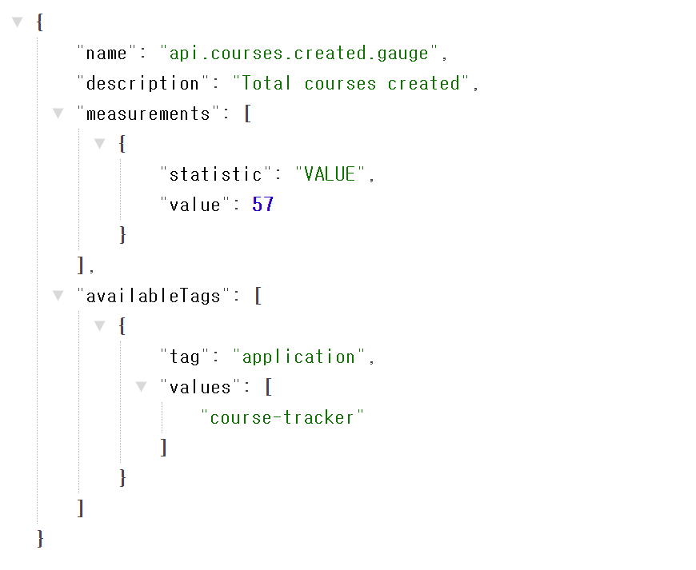
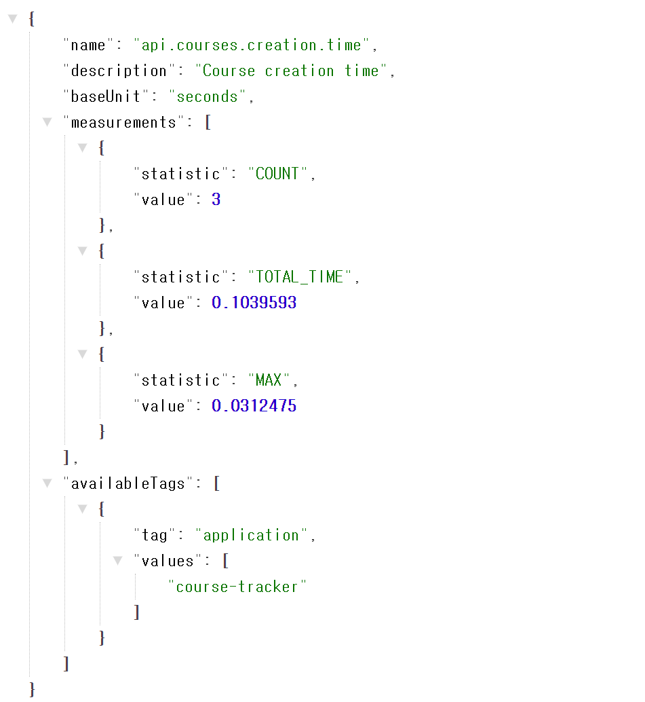
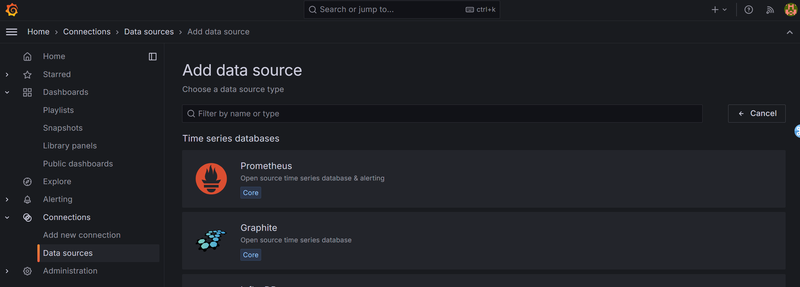
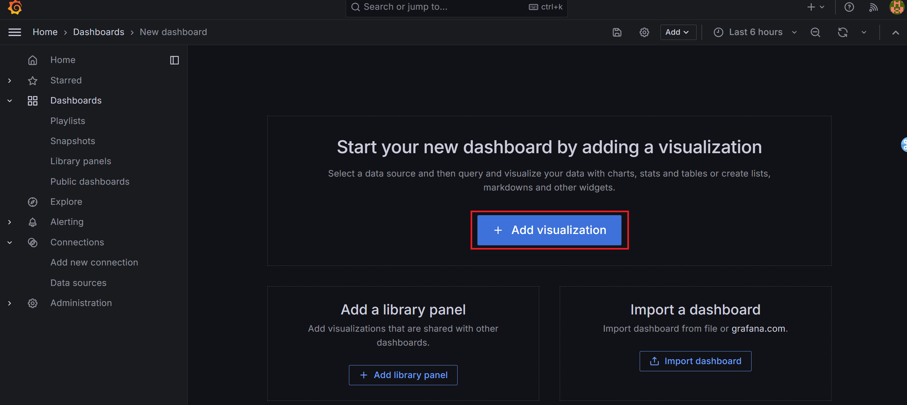
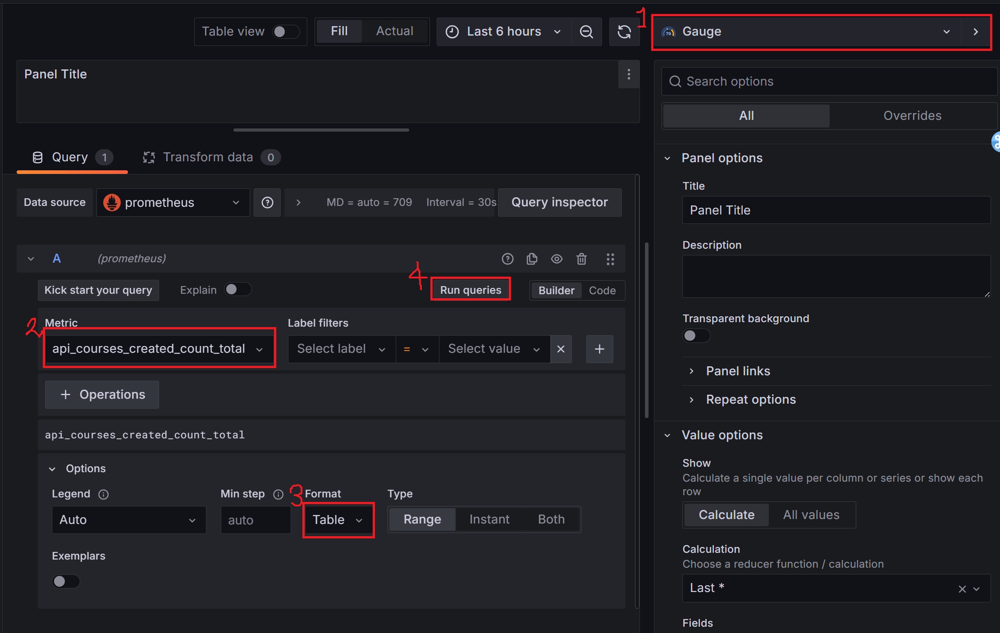
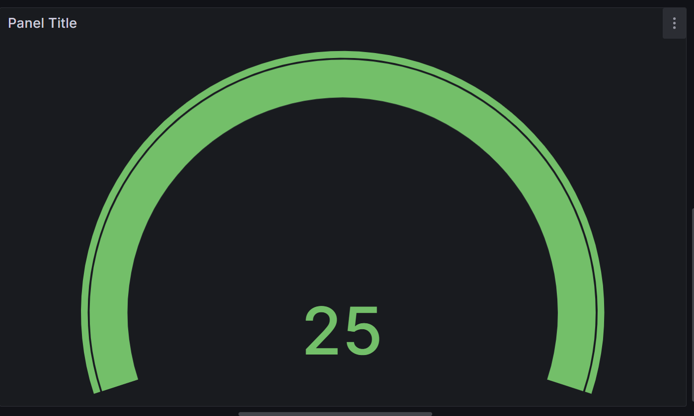

# 스프링 부트 액추에이터

- 애플리케이션이 상용 환경에서 배포되고 고가용성을 유지하기 위해서는 지속적인 모니터링이 필요하다.
- 모니터링에는 애플리케이션 상태 점검, 성능, 트래픽, 감사, 각종 측정지표, 재시작, 로그 레벨 변경 등의 다양한 작업이 필요하다.
- 스프링 부트 액추에이터는 모니터링과 관리에 필요한 기능을 제공한다.

> 의존성 추가
>> implementation 'org.springframework.boot:spring-boot-starter-actuator'

엑추에이터 엔드포인트는 웹(HTTP) 또는 JMX(java management extensions)를 통해 호출할 수 있으며, 액추에이터를 활성화/비활성화할 수 있다.  
예를 들어, `health`, `info`만 HTTP 접근이 노출되어 있고, 나머지는 노출되지 않는다.  
하지만, `JMX`는 `HTTP`보다 보안성이 높으므로 스프링 부트가 제공하는 모든 액추에이터 엔드포인트는 `JMX`에는 노출되어 있다.

- `/actuator`에 접속하면 현재 접속할 수 있는 액추에이터 엔드포인트 목록이 표시된다.
- 엔드포인트의 `templated` 값은 `true`이면 URL에 `{cache}`, `{toMatch}`와 같은 값을 지정할 수 있다.
- `http://localhost:8080/actuator/caches{cache}` 의 `{cache}` 대신 실제 캐시 이름을 지정하면 해당 캐시의 상태를 확인할 수 있다.

## 스프링 부트 액추에이터 엔드포인트

| 엔드포인트 이름         | 목적                                                                                                                 | HTTP 노출 | JMX 노출 |
|------------------|--------------------------------------------------------------------------------------------------------------------|---------|--------|
| auditevents      | 사용자 로그인/로그아웃 같은 보안 감사 정보 표시. `AuditEventRepository`빈 필요                                                            | X       | O      |
| beans            | 애플리케이션에 등록된 스프링 빈 전체 목록 표시                                                                                         | X       | O      |
| caches           | 애플리케이션에 사용된 모든 캐시 정보 표시                                                                                            | X       | O      |
| conditions       | 애플리케이션 설정 및 자동 구성에 사용된 조건과 조건에 부합하거나 부합하지 못하는 이유 표시                                                                | X       | O      |
| configprops      | `@ConfigurationProperties`으로 등록된 전체 설정 정보 표시                                                                       | X       | O      |
| env              | 스프링의 `ConfigurableEnvironment`로 등록된 모든 환경 설정 정보 표시                                                                 | X       | O      |
| flyway           | 플라이웨이 데이터베이스 마이그레이션 설정 정보 표시. 하나 이상의 Flyway 빈 필요                                                                   | X       | O      |
| health           | 애플리케이션 상태 정보 표시                                                                                                    | O       | O      |
| heapdump         | 애플리케이션이 사용 중인 JVM의 힙 덤프 파일 반환                                                                                      | X       | O      |
| httptrace        | 최근 100건의 HTTP 요청/응답 상세 정보 표시 `HttpTraceRepository` 빈을 설정해야 사용 가능                                                   | X       | O      |
| info             | 커스텀 데이터, 빌드 정보, 최신 커밋 등 애플리케이션 일반 정보 표시                                                                            | O       | O      |
| integrationgraph | 스프링 인티그레이션 컴포넌트 그래프 표시. `spring-integration-core` 의존 관계 필요                                                         | X       | O      |
| logfile          | 애플리케이션 로그 파일 내용 표시. `HTTP`의 `Range` 헤더를 사용해서 로그 파일 범위 지정 가능                                                        | X       | 해당 없음  |
| loggers          | 애플리케이션 로거 표시 및 로깅 설정                                                                                               | X       | O      |
| liquibase        | 리퀴베이스(liquibase) 데이터베이스 마이그레이션 설정 정보 표시 하나 이상의 `Liquibase` 빈 필요                                                    | X       | O      |
| metrics          | 애플리케이션 각종 측정 지표 표시                                                                                                 | X       | O      |
| mapping          | `@RequestMapping`으로 매핑된 모든 api 경로 표시                                                                               | X       | O      |
| prometheus       | 프로메테우스 서버로 수집할 수 있는 측정지표 표시 `micrometer-registry-prometheus` 의존 관계 필요                                              | X       | 해당없음   |
| scheduledtasks   | 주기적으로 실행되도록 설정된 작업 목록 표시                                                                                           | X       | O      |
| sessions         | 스프링 세션으로 관리하는 사용자 세션 정보 조회 및 삭제 스프링 세션을 사용하는 서블릿 기반의 웹 애플리케이션 사용 가능                                                | X       | O      |
| shutdown         | 애플리케이션 안전 종료(graceful shutdown)가 기본적으로 비활성화돼 있음                                                                    | X       | O      |
| startup          | `ApplicationStartup`으로 수집하는 애플리케이션 시작 단계별 데이터 표시 `SpringApplication` 클래스에 `BufferingApplicationSetup`이 설정돼 있어야 한다. | X       | O      |
| threaddump       | 스레드 덤프 출력                                                                                                          | X       | O      |


### 엔드포인트 관리
- 프로퍼티 설정을 변경하면 다른 엔드포인트도 `HTTP`로 노출
> management.endpoints.web.exposure.include
- 프로퍼티 설정을 변경하면 엔드포인트 `HTTP` 노출을 제외
> management.endpoints.web.exposure.exclude
- 기본 actuator 경로 변경
> management.endpoints.web.base-bath
- 개별 액추에이터 엔드포인트 이름 변경
> management.endpoints.web.path-mapping.health

## Custom Spring boot HealthIndicator 작성
디스크 용량 상태 정보를 보여주는 `DiskSpaceHealthIndicator`와 데이터베이스 상태를 보여주는 `DataSourceHealthIndicator` 처럼 스프링 부트에서 기본으로 제공하는 HealthIndicator을 활용할 수 있지만, 애플리케이션이나 애플리케이션과 연동하는 다른 REST API 시스템의 상태를 보여주는 커스텀 HealthIndicator를 만들어서 `health` 엔드포인트로 모니터링할 수 있다.

### 커스텀 스프링 부트 엑추에이터 HealthIndicator 정의

**요구 사항**  
애플리케이션이 의존하고 있는 핵심 외부 REST API 시스템 상태를 health 액추에이터 엔드포인트를 통해 확인해야 한다.

**해법**  
스프링 부트에 내장된 `HealthIndicator`은 애플리케이션에 특화된 컴포넌트에 대한 상태 정보를 보여주지는 않는다. 하지만 스프링 부트는 `HealthIndicator` 인터페이스를 통해 `health` 엔드포인트를 확장할 수 있도록 열어두었다.

```java
@Component
public class DogsApiHealthIndicator implements HealthIndicator {
    private static final String DOGS_API_URL = "https://dog.ceo/api/breeds/image/random";

    @Override
    public Health health() {
        try {
            ParameterizedTypeReference<Map<String, String>> reference =
                    new ParameterizedTypeReference<>() {
                    };

            ResponseEntity<Map<String, String>> result =
                    new RestTemplate().exchange(DOGS_API_URL, HttpMethod.GET, null, reference);

            if (result.getStatusCode().is2xxSuccessful() && result.getBody() != null) {
                return Health.up().withDetails(result.getBody()).build();
            } else {
                return Health.down().withDetail("status", result.getStatusCode()).build();
            }
        } catch (RestClientException e) {
            return Health.down().withException(e).build();
        }
    }
}
```
- 위의 예시 클래스는 `HealthIndicator`을 구현한 클래스로 애플리케이션 컴포넌트의 상태를 알려주는 역할을 한다는 것을 알 수 있다.
- 스프링 부트의 `RestTemplate`를 활용해서 외부 API를 호출하는 예시 이다.
- API 호출 성공시 `UP`, 실패시 `DOWN`과 예외를 반환한다.
- 위의 `HealthIndicator` 정보는 http://localhost:8081/api/actuator/health 에서 확인할 수 있다.

## info 엔드포인트

스프링 부트 액추에이터 엔드포인트를 통해 애플리케이션에 대한 정보를 확인하려면 `info` 엔드포인트를 활용할 수 있다. `info` 엔드포인트에서는 애플리케이션 관련 정보를 확인할 수 있다.

### info 엔드 포인트 관련 yaml 설정 정보
```yaml
info:
  app:
    name: Spring Boot Runner # application name 정보
    description: Spring Boot Runner that explores the /info endpoint # info endpoint에 대한 정보
    version: 0.0.1 # 버전 정보
  build: # 프로젝트 build 관련 정보
    artifact: "${project.artifactId}"
    name: "${project.name}"
    description: "${project.description}"
    version: "${project.version}"
    properties:
      java:
        version: "${java.version}"
```
```yaml
management:
  server:
    port: 8081 # 액추에이터를 실행할 포트 정보
  info:
    git: # info endpoint git config
      enabled: true
      mode: full
    env: # info endpoint env file config (ex: *.yml)
      enabled: true
    java: # info endpoint java config
      enabled: true
    os: # info endpoint os config
      enabled: true
  endpoints:
    web:
      base-path: /api/actuator # actuator basic path 변경
      exposure:
        include: "*" # 모든 엔드 포인트 노출
  endpoint:
    health:
      show-details: always # 상세 정보 표시
      status:
        http-mapping:
          down: 500 # server down 시 에러 정보
          out_of_service: 503
        order: DOWN, FATAL, OUT-OF-SERVICE, UNKNOWN, UP
```

- `Gradle`에서 빌드 정보 표시
> `@..@, ${}$`을 사용해서 메이븐 pom.xml 파일의 빌드 정보를 읽어올때 그레들 환경에서는 아래를 `build.gradle`에 추가하면 된다.
> ```
> springBoot {
>     buildInfo()
> }
> ```
> gradlew bootRun 명령으로 애플리케이션을 재시작하고 http://localhost:8081/api/actuator/info 엔드포인트에서 접근하면 빌드 정보를 확인할 수 있다.

- `git` 관련 정보 표시
> ```
> plugins {
>  id 'java'
>  id 'org.springframework.boot' version '3.2.1'
>  id 'io.spring.dependency-management' version '1.1.4'
>  id 'com.gorylenko.gradle-git-properties' version '2.4.1' # 추가
>  }
> ```
> `git.properties` 파일과 `build-info.properties` 파일은 각각 `GitInfoContributor` 클래스와 `Build-InfoContributor`클래스를 통해 자동으로 인식된다.

## 애플리케이션 정보를 표시하는 커스텀 InfoContributor
스프링 부트의 `InfoContributor` 인터페이스 구현체를 만들면 스프링 부트 액추에이터의 `info` 엔드포인트에 원하는 정보를 표시할 수 있다.  
`CourseTracker` 애플리케이션의 과정별 이름과 평점이 `info` 엔드포인트를 통해 표시되도록 커스텀 `InfoContributor`클래스를 만들어 보자.
```java
@Component
@RequiredArgsConstructor
public class CourseInfoContributor implements InfoContributor {
    private final CourseService courseService;

    /**
     * CourseTracker 애플리케이션의 과정별 이름과 평점이 info 엔드포인트를 통해 표시되도록 하는 커스텀 InfoContributor
     * contribute() 메서드를 재정의하면서 InfoContributor 인터페이스를 구현하고, courseService를 통해 모든 과정 정보를 읽어와서 과정 이름과 평점 목록을 구성하ㅗㄱ, Info.Builder 인스턴스에 추가
     * 실제 서비스 운영시 액추에이터 엔드포인트로 비즈니스 도메인 정보를 노출하거나 수정하는 것은 좋지않다. 실무적으로 비지니스 도메인 정보는 REST API 웹 서비스로 관리하는 것이 좋다.
     * @param builder
     */
    @Override
    public void contribute(Info.Builder builder) {
        List<CourseNameRating> courseNameRatingList = new ArrayList<>();
        for (Course course : courseService.findAllCourses()) {
            courseNameRatingList.add(CourseNameRating.builder().name(course.getName()).rating(course.getRating()).build());
        }
        builder.withDetail("courses", courseNameRatingList);
    }
    @Builder
    @Data
    private static class CourseNameRating {
        String name;
        int rating;
    }
}

```
- `contribute()` 메서드를 재정의하면서 `InfoContributor` 인터페이스를 구현하고, `courseService`를 통해 모든 과정 정보를 읽어와서 과정 이름과 평점 목록을 구성하고, `Info.Builder` 인스턴스에 추가한다. `Info.Builder`는 이름 그대로 `info`엔드포인트에 나타낼 데이터를 빌드하는 역할을 담당한다.  
- 스프링 부트 액추에이터를 통해 애플리케이션 비즈니스 도메인 상세 정보를 보여주고 있는데 액추에이터 앤드포인트로 비즈니스 도메인 정보를 노출하거나 수정하는 것은 바람직하지 않다. 비즈니스 도메인 정보는 REST API 웹 서비스로 관리하는 것이 좋다.  

## 커스텀 스프링 부트 액추에이터 엔드 포인트 생성
스프링 부트에서 제공하는 `@EndPoint` 애너테이션ㅇㄹ 붙여서 커스텀 엔드포인트 추가가 가능합니다.  
애플리케이션의 상세 릴리즈 정보를 보여주는 `releaseNotes` 엔드포인트를 추가하는 예제를 만들어 보겠습니다.

```java
@Log4j2
@SpringBootApplication
public class SpringRunnerApplication {

    public static void main(String[] args) {
        SpringApplication.run(SpringRunnerApplication.class, args);
    }

    /**
     * 애플리케이션에 특화된 비즈니스 상세 정보를 제공할 수 있는 액추에이터 엔드포인트 작성
     * 커스텀 엔드포인트를 추가하려면 @EndPoint 애너테이션을 붙여서 엔드포인트ㅔ 해당하는 자바 클래스를 정의하고
     * @ReadOperation, @WriteOperation, @DeleteOperation 애너테이션을 붙인다.
     * @return
     */
    @Bean(name = "releaseNotes")
    public Collection<ReleaseNote> loadReleaseNotes() {
        Set<ReleaseNote> releaseNotes = new LinkedHashSet<>();
        ReleaseNote releaseNote1 = ReleaseNote.builder()
                .version("v1.2.1")
                .releaseDate(LocalDate.now().minusMonths(1L))
                .commitTag("a7d2ea3")
                .bugFixes(Set.of(
                        getReleaseItem("SBIP-123", "The name of the matching-strategy property is incorrect in the action message of the failure analysis for a PatternParseException #28839"),
                        getReleaseItem("SBIP-124", "ErrorPageSecurityFilter prevents deployment to a Servlet 3.1 compatible container #28790")))
                .build();

        ReleaseNote releaseNote2 = ReleaseNote.builder()
                .version("v1.2.0")
                .releaseDate(LocalDate.now())
                .commitTag("44047f3")
                .newReleases(Set.of(getReleaseItem("SBIP-125", "Support both kebab-case and camelCase as Spring init CLI Options #28138")))
                .bugFixes(Set.of(getReleaseItem("SBIP-126", "Profiles added using @ActiveProfiles have different precedence #28724")))
                .build();
        releaseNotes.addAll(Set.of(releaseNote1, releaseNote2));
        return releaseNotes;
    }

    private ReleaseItem getReleaseItem(String itemId, String itemDescription) {
        return ReleaseItem
                .builder()
                .itemId(itemId)
                .itemDescription(itemDescription)
                .build();
    }
}
```
- 커스텀 엔드포인트를 추가하려면 `@EndPoint` 애너테이션을 사용하여 엔드포인트에 해당하는 자바 클래스를 정의하고 읽기, 쓰기, 삭제 연산을 담당하는 메서드를 정의하고 `@ReadOperation`, `@WriteOperation`, `@DeleteOperation` 애너테이션을 붙입니다.


```java
@Endpoint(id = "releaseNotes")
@Component
@RequiredArgsConstructor
public class ReleaseNotesEndpoint {
    private final Collection<ReleaseNote> releaseNotes;

    // http://localhost:8081/api/actuator/releaseNotes
    @ReadOperation
    public Iterable<ReleaseNote> releaseNotes() {
        return releaseNotes;
    }
    // http://localhost:8081/api/actuator/releaseNotes/{version}
    @ReadOperation
    public Object selectCourse(@Selector String version) {
        Optional<ReleaseNote> releaseNoteOptional = releaseNotes
                .stream()
                .filter(releaseNote -> version.equals(releaseNote.getVersion()))
                .findFirst();
        if (releaseNoteOptional.isPresent()) {
            return releaseNoteOptional.get();
        }
        return String.format("No such release version exists : %s", version);
    }
    // curl -i -X DELETE http://localhost:8081/api/actuator/releaseNotes/v1.2.1
    // curl 명령으로 릴리스 정보를 삭제할 수 있다.
    @DeleteOperation
    public void removeReleaseVersion(@Selector String version) {
        Optional<ReleaseNote> releaseNoteOptional = releaseNotes
                .stream()
                .filter(releaseNote -> version.equals(releaseNote.getVersion()))
                .findFirst();
        releaseNoteOptional.ifPresent(releaseNotes::remove);
    }
}

```
- 릴리스 정보를 표시하는 액추에이터 엔드포인트를 작성합니다.
- `id`값을 `releaseNotes`로 지정해서 엔드포인트의 이름을 `releaseNotes`로 지정합니다.
- 릴리즈의 상세 정보를 읽을 수 있도록 `releaseNotes` 클래스를 주입받습니다.
- 모든 정보의 릴리스 상세 정보를 반환하는 `@ReadOperation` 메서드를 정의합니다.
- 엔드포인트를 웹으로 노출해야 하므로 `yaml`에 `management.endpoints.web.exposure.include` 프로퍼티에 `releaseNotes`를 추가합니다. 
- `version` 인자에 `@Selector` 애너테이션을 붙이면 `releaseNotes-version`이라는 이름의 엔드포인트가 추가되고 version을 통해 접근 가능합니다.
- `removeRelaseVersion` 메소드는 특정 `version`의 릴리스 정보를 찾아서 삭제합니다.
- 스프링 부트는 범용적인 `@EndPoint`외에도 `JMX`를 통해서만 접근할 수 있는 `@JmxEndPoint`를 사용해서 정의할 수 있고, HTTP를 통해서만 접근할 수 있는 엔드포인트는 `@WebEndpoint`를 사용하면 됩니다.

## 스프링 부트 액추에이터 메트릭
스프링 부트는 `metrics` 엔드포인트를 통해 애플리케이션의 여러 측정지표 정보를 제공합니다.  
http://localhost:8081/api/actuactor/metrics 에 접근하여 여러 측정지표 목록을 확인할 수 있습니다.  
스프링 부트는 내부적으로 마이크로미터 프레임워크(https://micrometer.io/)를 사용해서 측정지표를 설정합니다. 또한, 카운터, 타이머, 게이지, 분표 요약 정보 같은 커스텀 측정지표도 정의할 수 있습니다.  
> 마이크로미터  
> 마이크로미터는 다양한 유형의 측정지표를 벤더 중립적인 방법으로 수집할 수 있는 파사드(facade)입니다.  
> 프로메테우스, 그라파이트, 뉴 렐릭등 다양한 모니터링 시스템 구현체 중에서 원하는 구현체를 선택해 플러그인 방식으로 사용할 수 있습니다.  
> 스프링 부트는 설정 파일과 클래스패스를 통해서 다양한 모니터링 시스템을 선택해 측정지표를 수집할 수 있습니다.  
> 
> 마이크로미터는 벤더 중립적인 측정지표 수집 API와 프로메테우스 같은 모니터링 프레임워크 구현체를 포함하고 있습니다.


`metrics` 엔드포인트는 애플리케이션의 성능과 전반적인 상태를 모니터링할 수 있도록 도와줍니다.  
metrics로 확인할 수 있던 지표는 마이크로미터에 내장된 항목들이고 스프링 부트가 자동 구성으로 쉽게 사용할 수 있게 해준 것입니다.  
예를 들어 마이크로미터 프레임워크는 JVM 가비지 컬렉션, 메모리, 스레드 정보를 각각 `JvmGcMetrics`, `JvmMemoryMetrics`, `JvmThreadMetrics`클래스를 통해 제공합니다.  
모든 측정 지표는 `JvmMetricsAutoConfiguration` 클래스를 통해 자동 구성 됩니다.


---
스프링 부트는 `MeterRegistry`를 사용해서 자동 구성으로 여러 개의 레지스트리 구현체를 추가할 수 있다. 그래서 한 개 이상의 모니터링 시스템에 측정지표를 내보내서 사용할 수 있다. 또한 `MeterRegistryCustomizer`를 사용해서 레지스트리 커스터마이징도 가능합니다.  
예를 들어 측정지표를 프로메테우스와 뉴 렐릭으로 보내고 두 개의 레지스트리에 공통으로 태그 셋을 설정해서 사용할 수 있습니다. 태그는 식별자로 이용됩니다.  
즉, 다수의 애플리케이션이 측정지표를 내보낼 때 애플리케이션 이름을 식별하기 위해 태그를 사용할 수 있습니다.
```java
/**
 * MeterRegistryCustomizer를 사용한 커스텀 MeterRegistry
 */
@Bean
MeterRegistryCustomizer<MeterRegistry> metricsCommonTags() {
    return registry -> registry.config()
            .commonTags("application", "course-tracker");
}
```
http://localhost:8081/api/actuator/metrics/jvm.buffer.memory.used?tag=application:course-tracker  
쿼리 스트링을 이용하여 태그 기준으로 필터링된 측정지표를 확인할 수 있습니다.  
위의 url에서는 jvm 버퍼 메모리 사용 측정지표를 확인할 수 있습니다.

## 커스텀 측정지표 생성
스프링 부트는 개발자가 애플리케이션을 모니터링하는데 필요한 애플리케이션 특화된 데이터를 보여주는 커스텀 측정지표를 정의하고 수집해서 확인할 수 있는 기능을 제공합니다.  
마이크로미터 프레임워크는 커스텀 측정지표를 생성할 때 사용할 수 있는 `카운터(Counter)`, `게이지(Gauge)`, `타이머(Timer)`, `분포 요약(DistributionSummary)`과 같은 다양한 측정 단위를 제공합니다.

- 생성된 과정의 수를 `Counter`를 사용해서 확인
- 생성된 과정의 수를 `Gauge`를 사용해서 확인
- 과정 생성에 소요된 시간을 `Timer`를 사용해서 확인
- 과정 평점에 대한 분표 요약을 `DistributionSummary`를 사용해서 확인 

### Counter
`Counter`는 증가할 수있는 개수나 횟수를 의미합니다. 예를 들어 어떤 메서드가 호출되는 횟수를 카운트로 나타낼 수 있습니다. 그래서 과정을 생성하는 메서드의 호출 횟수를 `Counter`로 세면 생성된 과정의 총 개수를 알 수 있습니다.  

```java
/**
 * Counter는 증가할 수 있는 개수나 횟수를 의미
 * 아래에서는 어떤 메소드가 호출되는 횟수를 카운팅
 * http://localhost:8081/api/actuator/metrics/api.courses.created.count
 */
// http://localhost:8081/api/actuator/metrics/api.courses.created.count 에서 확인 가능
@Bean
public Counter createCourseCounter(MeterRegistry meterRegistry) {
    return Counter.builder("api.courses.created.count")
            .description("Total number of courses created")
            .register(meterRegistry);
}
```

```java
public Course createCourse(Course course) {
    createCourseCounter.increment();
    return courseRepository.save(course);
}
```
이벤트 리스너를 사용하면 Counter를 비즈니스 로직에서 분리할 수 있다.  
> package com.example.runner.domain.course.event  
> 위의 패키지에서 이벤트 리스너를 통한 로직 분리를 확인할 수 있다.  

http://localhost:8081/api/actuator/metrics/api.courses.created.count 에 접근하여 지금까지 생성된 과정의 수를 확인할 수 있다.


### Guage
`Counter`의 단점은 애플리케이션 종료 후에 카운터 값이 유지되지 않는 점이다. 게이지는 카운터와 마찬가지로 개수나 횟수를 셀 수 있지만, 데이터베이스를 이용하므로 값을 저장하고 `Gauge` 측정지표를 통해서 값을 확인할 수 있다.

```java
/**
 * Counter의 단점은 메모리 기반으로 운영되기 때문에 애플리케이션이 재시작되면 초기화 된다.
 * Guage는 카운터와 마찬가지 이지만, 데이터베이스를 이용해서 값을 저장한다.
 * http://localhost:8081/api/actuator/metrics/api.courses.created.gauge
 */
@Bean
public Gauge createCoursesGauge(MeterRegistry meterRegistry, CourseService courseService) {
    return Gauge.builder("api.courses.created.gauge", courseService::count)
            .description("Total courses created")
            .register(meterRegistry);
}
```

`Guage`를 `MeterRegistry`에 등록하는 것은 카운터와 비슷하나 생성된 과정의 개수를 `CourseService`의 `count()` 메서드를 통해 데이터베이스에서 가져온다는 것이 다르다.  
`Guage`를 사용할 경우 서버가 종료되어도 과정의 개수가 유지된는 것을 확인할 수 있다.

> Guage의 어댑터 패턴을 이용하여 진행하였습니다.  
> `Wrapper` 패턴은 `Adapter` 패턴에 속하는 디자인 패턴으로 객체의 인터페이스를 다른 인터페이스로 감싸서 사용하는 것을 목적으로 합니다.  
> 주로 기존의 코드를 수정하지 않고 새로운 기능을 추가하기 위하여 사용됩니다. 



### Timer
개수나 횟수를 셀 때 `Couter`와 `Guage`를 사용하였다면 연산을 수행할 때 소요되는 시간을 측정할 때는 `Timer`를 이용해 볼 수 있다.

```java
/**
 * 개수나 횟수를 셀 때 Counter나 Gauge를 사용할 수 있다. 하지만 연산에 소요된느 시간을 측정해야 할 때도 있다.
 * 또한, 수행 시간이 결정적으로 중요한 애플리케이션에서는 SLA에서 정한 시간 내에 작업이 완료되는지 확인해야 한다.
 * Timer 인터페이스의 recordCallable() 메서드를 사용해서 과정을 생성
 * 타이머는 내부적으로 Callable 객체 안에서 과정 생성시 소요되는 시간을 측정
 * recordCallable은 예외를 던질 수 있으므로 @SneakyThrows 애너테이션을 사용해서 처리
 * http://localhost:8081/api/actuator/metrics/api.courses.creation.time
 */
@Bean
public Timer createCoursesTimer(MeterRegistry meterRegistry) {
    return Timer.builder("api.courses.creation.time")
            .description("Course creation time")
            .register(meterRegistry);
}
```

`Timer` 인터페이스의 `recordCallable()` 메서드를 사용해서 과정을 생성하고 있다. `recordCallable()` 메서드는 `java.util.concurrent.Callable` 타입을 인자로 받으므로 생성된 과정을 데이터베이스에 저장하고 값을 반환하는 `Callable` 객체를 람다식을 사용해서 정의한다.



### Distribution Summary
분포 요약(Distribution Summary)는 이벤트의 분포를 측정한다. Timer와 구조적으로는 비슷하지만 측정 단위가 시간이 아니라는 점에서 차이가 있다.

```java
/**
 * 분포 요약 (Distribution Summary)은 이벤트의 분포를 측정
 * Timer와 구조적으로 유사하지만 측정 단위가 시간이 아니다.
 * COUNT는 생성된 과정의 수
 * TOTAL은 과정에 매겨진 평점의 총합
 * MAX는 최고 평점을 의미
 * http://localhost:8081/api/actuator/metrics/api.courses.rating.distribution.summary
 */
@Bean
public DistributionSummary createDistributionSummary(MeterRegistry meterRegistry) {
    return DistributionSummary.builder("api.courses.rating.distribution.summary")
            .description("Rating distribution summary")
            .register(meterRegistry);
}
```

`COUNT`는 생성된 과정의 수를 의미하고 `TOTAL`은 과정에 매겨진 평점의 총합을 의미


## 프로메테우스와 그라파나
### 프로메테우스
프로메테우스는 모니터링 시스템이며 스프링 부트는 클래스패스에 프로메테우스 라이브러리가 있으면 스프링 부트에 내장된 측정지표 및 커스텀 측정지표 전부를 프로메테우스에 전송한다.

> 프로메테우스
> 프로메테우스는 사운드클라우드에서 처음 만들어진 오픈소스 모니터링 시스템이자 알림 도구다.
> 스프링 부트는 프로메테우스와 아주 쉽게 연동할 수 있으며 `/api/actuator/prometheus` 엔드포인트를 통해 확인할 수 있다.

- 의존 관계 추가
> runtimeOnly 'io.micrometer:micrometer-registry-prometheus'

http://localhost:8081/api/actuator/prometheus 에 접속해 보면 사용할 수 있는 측정지표 목록이 표시된다.

- 프로메테우스 설치
https://prometheus.io/download 에서 설치를 진행

설치 완료 후 실행 시키면 http://localhost:9090 에서 접근할 수 있다.

```yaml

scrape_configs:
  # The job name is added as a label `job=<job_name>` to any timeseries scraped from this config.
  - job_name: "prometheus"

    # metrics_path defaults to '/metrics'
    # scheme defaults to 'http'.

    static_configs:
      - targets: ["localhost:9090"]

  # 추가 되는 부분
  - job_name: "spring-actuator"
    metrics_path: "/api/actuator/prometheus"
    scrape_interval: 5s
    static_configs:
      - targets: ["localhost:8081"]
```
프로메테우스의 `prometheus.yml`파일에서 actuator 접근을 위하여 job을 설정해준다. 


앞서 설정한 Courses actuator 측정 지표를 확인할 수 있다.

### 그라파나
- 프로메테우스도 데이터를 보여주기는 하지만 시각적으로 모니터링을 수행하기 위해서 그라파나를 사용해 볼 수 있다.  
- https://grafana.com/grafana/download?edition=oss 에서 다운로드 진행  
- 설치 후 `/bin` 디렉토리의 `grafana-server` 파일을 실행한다.
- http://localhost:3000 에 접속하면 그라파나 로그인 화면이 표시된다.
- **초기 계정 정보**는 `admin/admin` 입니다.


URL에 프로메테우스에 접속할 수 있는 주소 (http://localhost:9090)을 입력하고 **[Save & Test]** 버튼을 클릭하여 데이터베이스를 연결한다.  




대시보드 구성 준비


모니터링 쿼리 구성


모니터링 게이지 확인 및 저장 진행

비슷한 방식으로 1분당 생성되는 과정의 개수, JVM 스레드 상태, 시스템 CPU 사용률 등을 나타내는 패널을 추가하여 대시보드를 구성할 수 있다.